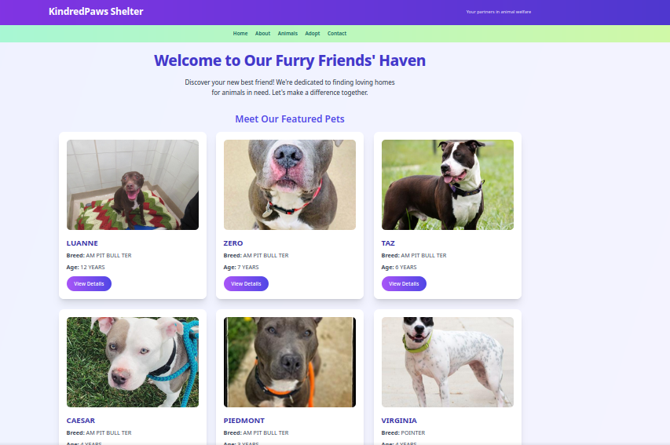
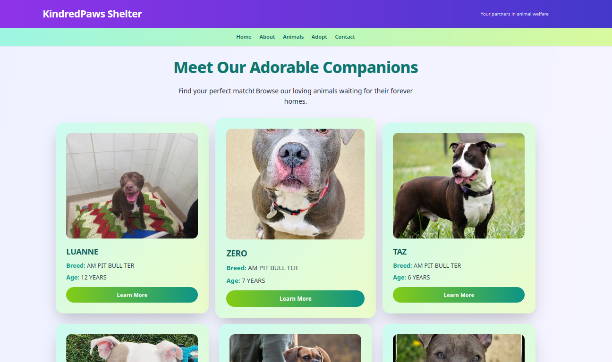
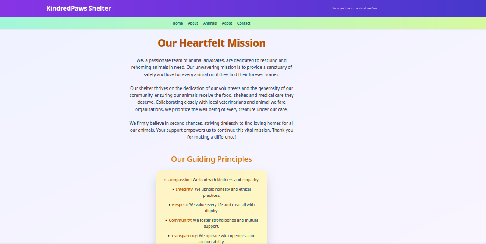
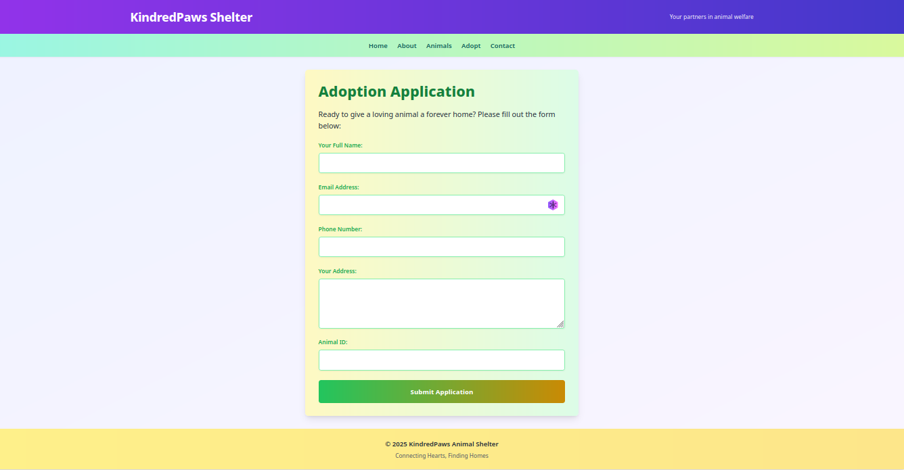
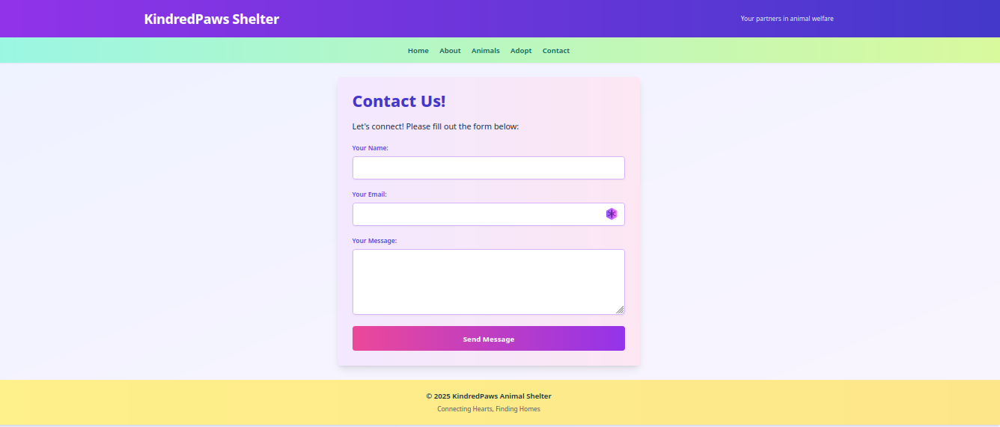

# KindredPaws: A Local Animal Shelter Website

This project is a dynamic, multi-page website designed to help a local animal shelter manage and showcase their animals available for adoption. It utilizes PHP, SQL, and Python to provide a full-stack web application.

## Features

* **Animal Listings:** Browse a list of animals available for adoption, with details and images.
* **Animal Details:** View individual animal profiles with comprehensive information.
* **Adoption Application:** Submit an online adoption application form.
* **Contact Form:** Contact the shelter via an online form.
* **About Us:** Learn more about the shelter's mission and values.
* **Dynamic Content:** Data is dynamically fetched from a MySQL database.
* **Image Processing:** Python scripts are used for image processing, including adding watermarks.
* **Responsive Design:** The website is responsive and adapts to different screen sizes, using Tailwind CSS.

## Technologies Used

* **PHP:** Server-side scripting for dynamic content generation.
* **SQL (MySQL):** Database management for storing animal and adopter information.
* **Python:** Backend tasks, specifically image processing using the Pillow (PIL) library.
* **HTML5:** Structure of the web pages.
* **Tailwind CSS:** Styling and responsive design.

## Project Structure
```
animal_shelter/
├── public/
│   ├── index.php
│   ├── about.php
│   ├── animals.php
│   ├── adopt.php
│   ├── contact.php
│   ├── animal_details.php
│   ├── process_adoption.php
│   ├── process_contact.php
│   ├── css/
│   │   └── style.css
│   ├── images/
│   ├── js/
├── includes/
│   ├── db_connect.php
│   ├── functions.php
│   ├── header.php
│   ├── footer.php
│   ├── navigation.php
├── python/
│   ├── image_processing.py
├── database/
│   └── animal_shelter.sql
```
## Setup Instructions

1.  **Environment Setup:**
    * Install a web server (Apache, Nginx), PHP, MySQL, and Python 3.
    * Install the Pillow library for Python: `pip install Pillow`.
    * Install tailwindcss or use the cdn link.
2.  **Database Setup:**
    * Create a MySQL database named `animal_shelter`.
    * Import the `animal_shelter.sql` file into the database.
    * Configure the database credentials in `includes/db_connect.php`.
3.  **Project Placement:**
    * Place the `animal_shelter` folder in your web server's document root.
4.  **Running the Application:**
    * Open your web browser and navigate to `localhost/animal_shelter/public/` (or your server's URL).

## Image Processing

* The `python/image_processing.py` script adds a watermark to uploaded images.
* PHP uses the `exec()` function to execute the Python script.
* Ensure that the Python script has the necessary permissions and that the file paths are correct.

## UI Overview

### Home


### Animals


### About


### Adopt


### contact



## Contributing

Contributions are welcome! Please feel free to submit pull requests or open issues for bug fixes or feature requests.

## License
This program is free software: you can redistribute it and/or modify
    it under the terms of the GNU General Public License as published by
    the Free Software Foundation, either version 3 of the License, or
    (at your option) any later version.

    This program is distributed in the hope that it will be useful,
    but WITHOUT ANY WARRANTY; without even the implied warranty of
    MERCHANTABILITY or FITNESS FOR A PARTICULAR PURPOSE.  See the
    GNU General Public License for more details.

    You should have received a copy of the GNU General Public License
    along with this program.  If not, see <https://www.gnu.org/licenses/>.
    
  See the LICENSE file for more details. See the [LICENSE](LICENSE) file for details.
